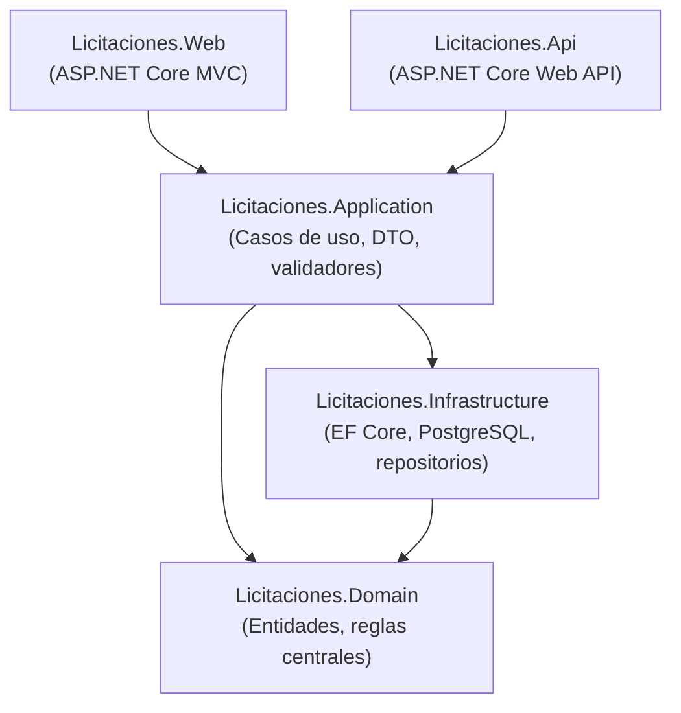
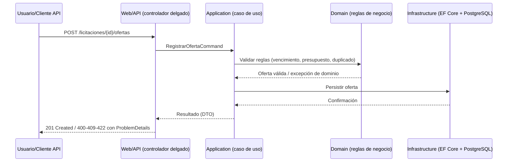

# Arquitectura General

## Estilo

Monolito modular en capas, organizado por proyectos independientes dentro de
`/src`, con separación estricta de responsabilidades. Puede evolucionar a
microservicios si la separación se justifica técnicamente (ver sección 6.3 del
enunciado), sin que esto cambie el cumplimiento de los requisitos funcionales.

## Diagrama de capas

- **Domain** no depende de ninguna otra capa (sin referencias a EF Core ni a
  ASP.NET Core).
- **Application** orquesta casos de uso y depende solo de contratos
  (interfaces) implementados por Infrastructure.
- **Infrastructure** implementa los puertos definidos en Application/Domain.
- **Web** y **Api** son las dos formas de exponer los mismos casos de uso;
  ninguna contiene lógica de negocio propia (controladores delgados).

## Flujo de una operación típica (registrar oferta)

