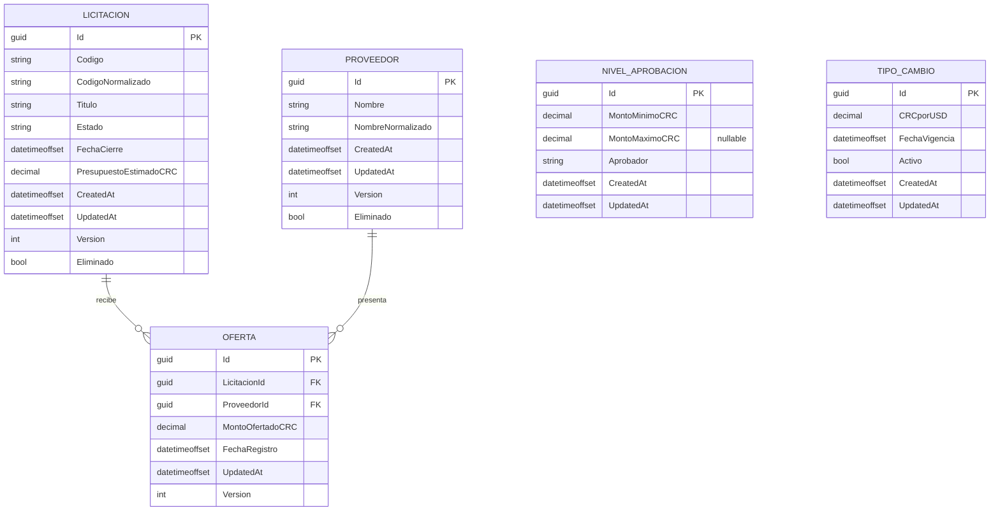

# Modelo de Datos

## Diagrama entidad-relación

> `NIVEL_APROBACION` y `TIPO_CAMBIO` no tienen relación de clave foránea directa
> con `LICITACION`: el aprobador y el tipo de cambio activo se resuelven en
> tiempo de consulta según el monto y la fecha vigente, respectivamente.

## Restricciones clave

- Índice único en `Licitacion.CodigoNormalizado`.
- Índice único en `Proveedor.NombreNormalizado`.
- Índice único compuesto en `Oferta (LicitacionId, ProveedorId)`.
- `CHECK` en montos: `PresupuestoEstimadoCRC > 0`, `MontoOfertadoCRC > 0`,
  `CRCporUSD > 0`.
- `NivelAprobacion`: rangos no traslapados; a lo sumo un rango con
  `MontoMaximoCRC IS NULL` (rango abierto).
- `TipoCambio`: a lo sumo un registro con `Activo = true` (índice único
  filtrado / trigger, según proveedor de PostgreSQL disponible).
- Todos los montos usan `numeric(18,2)`; **prohibido** `float`/`double`.
- Concurrencia optimista mediante columna `Version` (xmin o columna dedicada)
  en `Licitacion`, `Proveedor` y `Oferta`.
